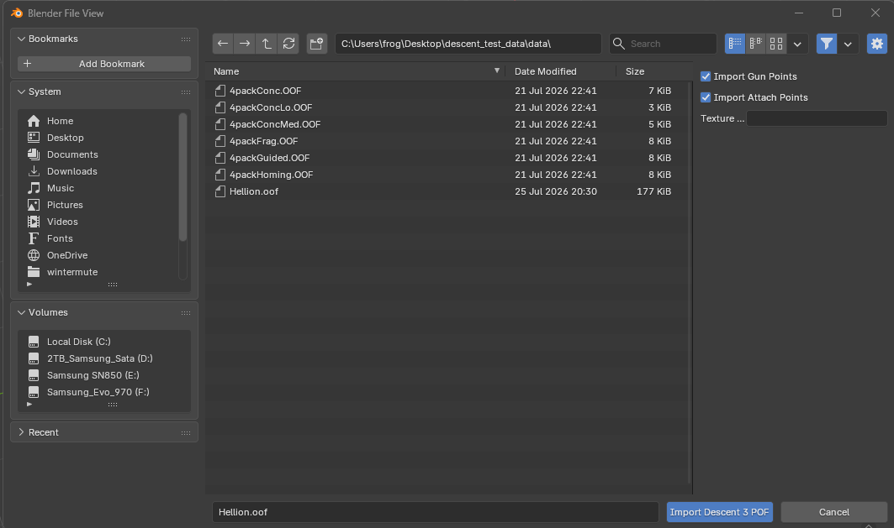
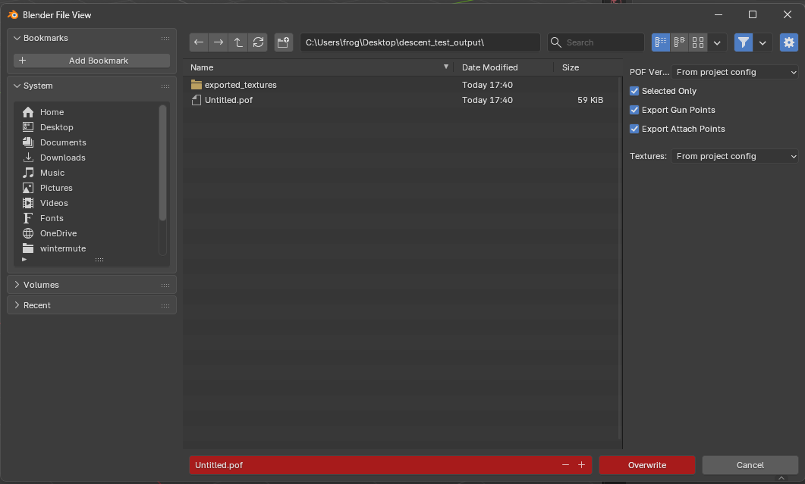
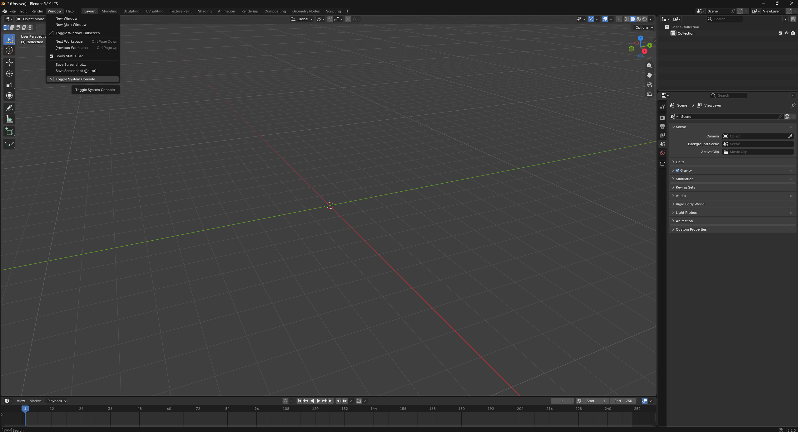

# Descent 3 POF/OOF Importer/Exporter for Blender

A Blender add-on for importing and exporting Descent 3 polygon model files
(`.pof` / `.oof`). It supports vertices, faces, UV mapping, materials with
image textures, the submodel hierarchy, gun points, attach points, and animation
keyframes.

- **Blender:** 4.2+ (developed and tested against 5.2 LTS)
- **Location in Blender:** `File → Import/Export → Descent 3 POF/OOF (.pof, .oof)`

## Documentation

- [Importing](docs/importing.md) — viewport shading, material reuse, damaged
  files, marker orientation.
- [Exporting](docs/exporting.md) — which objects become submodels, transforms and
  authored normals, offsets, marker selection and ordering, material names as
  texture IDs, writing texture images.
- [How textures are located](docs/textures.md) — the four search directories and
  their priority, extension order, case-insensitive fallback, missing textures.
- [Custom properties](docs/custom-properties.md) — the `pof_*` and `d3_*` keys,
  which datablock carries each, what export reads back, which to set by hand.
- [Configuration](docs/configuration.md) — `descent3.toml` project settings,
  per-user add-on preferences, and the format constants that are not settings.
- [Development](docs/development.md) — the `bpy`-free contract, the test runners
  and Blender's own Python, the tests that need Blender, the manifest, versioning.
- [Design notes](docs/design-notes.md) — the coordinate rotation, the separate
  UV flip, what the custom properties carry, round-trip fidelity.

## Installation

> **Important:** the add-on must be installed as a **package folder**, not as
> loose files. It uses relative imports (`from . import poformat`), so all
> eleven modules have to sit together inside a `descent3_plugin/` directory,
> along with the manifest:
>
> ```
> scripts/addons/descent3_plugin/
>   ├── __init__.py
>   ├── blender_manifest.toml
>   ├── config.py
>   ├── constants.py
>   ├── export_pof.py
>   ├── import_pof.py
>   ├── mathutil.py
>   ├── naming.py
>   ├── poformat.py
>   ├── preferences.py
>   ├── texexport.py
>   └── texutil.py
> ```
>
> Dropped directly into `scripts/addons/`, the loose `.py` files cannot load as
> a package — the import/export operators never register and Blender warns that
> `poformat.py` is "missing `bl_info`". Leaving *one* module behind is quieter
> and just as fatal: a `ModuleNotFoundError` naming a file you may not have
> known existed. Copy the folder, not its contents.

### Option 1 — install script (recommended)

`install.ps1` (Windows) and `install.sh` (Linux/macOS) find every Blender on the
machine — Steam, standalone installers, portable builds, Flatpak, Snap, macOS app
bundles — work out each one's version, and copy the package folder into that
version's user add-ons directory. Run from the repo root:

```powershell
.\install.ps1 -List        # show every Blender found and where it would install
.\install.ps1              # install into the newest version
.\install.ps1 -All         # install into every version found
.\install.ps1 -Version 4.2 # install into one specific version
.\install.ps1 -DryRun      # print what would happen, change nothing
.\install.ps1 -Clean       # wipe the destination folder first
```

```bash
./install.sh --list        # same flags, long-form: --all --version 4.2 --dry-run --clean
./install.sh
```

If Blender lives somewhere unusual, skip detection with `-Target` / `--target`
and pass either a version root (`…/Blender/5.2`) or an add-ons directory
directly. Steam and standalone Blender share the same user config directory, so
a given version only needs installing once no matter where the executable lives.
The scripts always copy the whole package folder, clear stale `__pycache__`, and
warn about the loose-file mistake above.

### Option 2 — install by hand

1. Zip the `descent3_plugin/` folder (so the zip contains the folder, not just
   its files).
2. In Blender: `Edit → Preferences → Add-ons → Install from Disk…`, choose the
   zip, then enable **"Import-Export: Descent 3 POF/OOF Importer/Exporter"**.

Alternatively, copy the `descent3_plugin/` folder straight into your Blender
`scripts/addons/` directory and enable it in Preferences. Either way, after
updating the files **restart Blender** (or toggle the add-on off/on) so the new
code loads.

## Importing

`File → Import → Descent 3 POF/OOF (.pof)`.



Options live in the file browser sidebar:

| Option | Description |
|--------|-------------|
| **Import Gun Points** | Import gun-point markers as empty objects |
| **Import Attach Points** | Import attach points as empty objects |
| **Texture Folder** | Optional folder to search for texture images, ahead of everywhere else (see [How textures are located](docs/textures.md)). Leave it empty and the search falls back to the project's `descent3.toml`, the model's own folder, and your Texture Library preference |

More in [docs/importing.md](docs/importing.md) — and in
[docs/textures.md](docs/textures.md) for how a texture name becomes a file.

## Exporting

`File → Export → Descent 3 POF/OOF (.pof)`.



| Option | Description |
|--------|-------------|
| **POF Version** | Which format version to write. Leave it on *From project config* and the version in your `descent3.toml` applies; pick a specific one to override it for this export |
| **Selected Only** | Export only the selected objects rather than every mesh in the file. It bounds the gun and attach markers too, not just the meshes (see [Exporting](docs/exporting.md#what-gets-exported)) |
| **Export Gun Points** | Write empties named with the gun prefix as GPNT gun points |
| **Export Attach Points** | Write empties named with the attach prefix as ATCH attach points |
| **Textures** | Also write each material's image beside the model. *None* by default; *From project config* uses `texture_format` from your `descent3.toml` |

More in [docs/exporting.md](docs/exporting.md): what gets exported, how material
names become texture IDs, and what the **Textures** option writes.

## Seeing what the add-on is doing

Most of what the add-on has to tell you — a texture it could not find, a
material that looks like a Blender duplicate, a file that ends mid-chunk — goes
to Blender's system console. The status bar shows only the last line, so open
the console before investigating anything.

`Window → Toggle System Console`



On Linux and macOS there is no menu item: Blender is already attached to the
terminal that launched it, so start it from one and the output appears there.

Typical output for a healthy import:

```
[Descent3] Importing: C:\models\Hellion.oof
[Descent3] v2300: 2 textures, 1 submodels; texture search: [...]
[Descent3] textures 2/2 found
```

and for one that needs attention:

```
[descent3_plugin] Texture not found: Hull (searched [...])
[descent3_plugin] Material 'Hull.001' looks like a Blender duplicate ...
```

Every module logs under the one `descent3_plugin` name, so that prefix is what
to grep the console for — there is no per-module tag to guess at.

## Licence

GPL-3.0-or-later — see `LICENSE`. The add-on redistributes the Descent 3
engine sources under `reference/`, which are GPL-3.0-or-later, © 2024
Parallax Software.

Test assets:

- `tests/mock_data/` — hand-written `.pof` files for parser tests
  (regenerate with `python tests/generate_mock_pof.py`).
- `tests/fixtures/textured_model/` — a committed real-format `.oof` plus the
  `.png` textures it references, used to test parsing + texture resolution
  end-to-end (regenerate with `python tests/generate_fixtures.py`).

Anything that touches Blender (materials, images, mesh building, operator
registration) is verified by running Blender headless against a real model; see
the `.claude/skills/blender-addon-testing` skill for the workflow, and
`.claude/skills/oof-pof-format` for the binary format reference.

## Repository layout

```
descent3_plugin/      the add-on (install this folder)
  __init__.py           registration and menu entries (no bpy at import time)
  import_pof.py         ImportPOF operator and POF -> Blender conversion
  export_pof.py         ExportPOF operator and Blender -> POF conversion
  texexport.py          writing texture images beside an exported model
  config.py             per-project descent3.toml settings (no bpy)
  preferences.py        per-user add-on preferences
  constants.py          values shared by the import and export halves (no bpy)
  mathutil.py           Vector3 and math helpers (no bpy)
  naming.py             material-name to texture-ID rules (no bpy)
  poformat.py           POF/OOF binary parser & writer (no bpy)
  texutil.py            texture-path resolution helpers (no bpy)
  blender_manifest.toml canonical version + extension metadata
descent3.example.toml   documented template for a project config
install.ps1 install.sh  find every Blender and deploy the package folder
run_tests.sh run_tests.ps1   run pytest under Blender's own Python
docs/                   the long-form documentation
  importing.md            material reuse, damaged files, marker orientation
  exporting.md            what is exported, texture names, texture images
  textures.md             how a texture name becomes an image file on import
  custom-properties.md    the pof_* and d3_* keys and what export reads back
  configuration.md        descent3.toml, add-on preferences, format constants
  development.md          the bpy-free contract, the tests, versioning
  design-notes.md         decisions and the reasoning behind them
  images/                 screenshots used by this README and those pages
LICENSE                 GPL-3.0-or-later
tests/                  pytest suite, mock data, and fixtures
reference/              vendored Descent 3 engine sources (GPL-3, not installed)
.claude/skills/         reference notes for the headless test workflow and the
                        binary format
```
