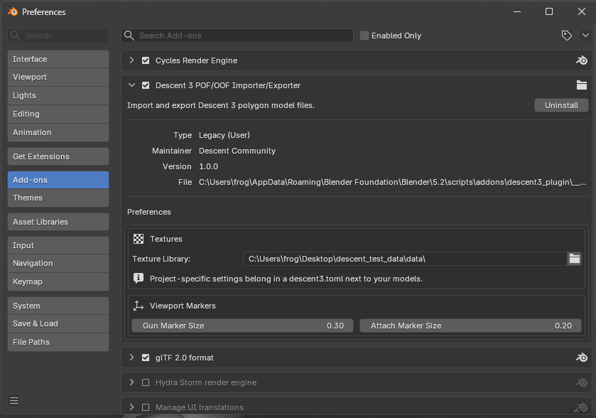

# Configuration

[<- README](../README.md)

Settings live in one of three places, chosen by who owns the value: the
per-project `descent3.toml`, the per-user add-on preferences, and the format
constants that are deliberately not settings at all.

## Project settings — `descent3.toml`

Conventions the importer and exporter must agree on — both halves read this one
file. Export identifies gun and attach points purely by name prefix, so if
import writes `Gun_0` and export looks for `gun.0`, the point is silently
dropped.

Put a `descent3.toml` at your project root; the add-on searches from the
model's folder upwards, so one file covers every model beneath it and a file
closer to a model wins. Copy `descent3.example.toml` to start — it documents
every key, fully commented out, so copying it verbatim changes nothing.

```toml
[naming]
gun_prefix = "Muzzle_"

[textures]
# relative to this file, not your working directory
search_dirs = ["../shared/textures"]

[export]
version = 2200
```

A missing file means defaults — the add-on's behaviour before configuration
existed. A malformed file degrades to those defaults and reports the problem
rather than blocking the import; unknown keys are reported so a typo does not
fail silently.

## User settings — add-on preferences

`Edit → Preferences → Add-ons → Descent 3 POF/OOF`. These follow you between
projects and stay out of anyone else's repository: your own texture library
folder, and the viewport size of the gun and attach markers.



**Texture Library** is a fallback for textures you keep outside any one project
— an extracted copy of the game's bitmaps, say. It is searched *last*, so it
never overrides a texture that ships beside the model.

Texture search order, most specific first: the import dialog's **Texture
Folder**, then `search_dirs` from the project's `descent3.toml`, then the
model's own folder, then the **Texture Library** from preferences. Entries 1
and 4 drop out when unset — [How textures are located](textures.md) states the
full rules.

The folder that texture *export* writes into is **not** on that list. See
[Exporting textures](exporting.md#exporting-textures).

## Format constants — not configurable

Version gates, chunk IDs and flag bits are facts about the POF binary format,
not settings. They live in `poformat.py` with deliberately no way to override
them: a project that changed one would write models the game cannot load. The
supported version matrix is declared once as `VersionFeatures`, consulted by
both the reader and the writer, so the two cannot disagree about a record's
layout.
